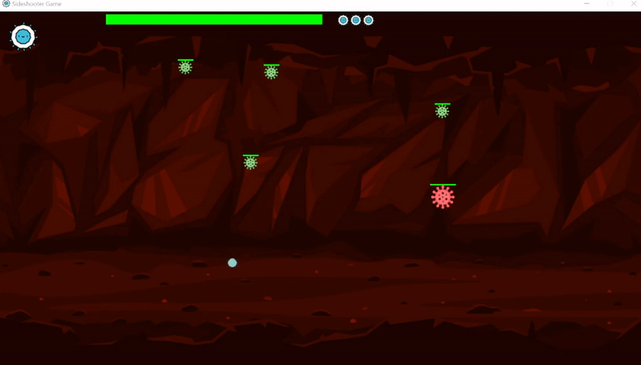
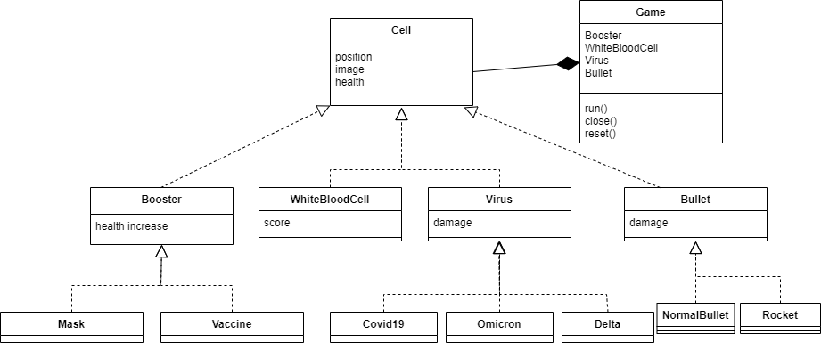

# Sideshooter-Game-Python
## Description 
A game where you can shoot at enemies at the right of the screen in a scenario that is scrolling horizontally. 

If you have windows, you can [download the game executable here](https://github.com/igor-lirussi/Sideshooter-Game-Python/releases/latest/download/Sideshooter-Game-Python.exe).

It's a simple example on how to use OOP principles.
### Topics:
- Classes 
- Basic Game Loop
- Sprites
- Key Inputs & Events
- Movements:
	- Controlled
	- Autonomous
- Collisions
- Game Mechanics
- Health system, score and stats
- Music

## Result


## Requirements
- Python 3
- Pygame

## Run
if your environment has the [`Requirements`](#requirements) you can start the game typing: 
```bash
python game.py
```
otherwise see the  [`Installation`](#installation) below

## Installation
in *Anaconda Prompt*:
```bash
conda create -n pygame python=3.10 #creates environment called "pygame" with python
conda activate pygame  #activates the environment (you need to activate the environment every time)
pip install pygame
```

## Class Diagram


## Authors
* **Igor Lirussi** @ BOUN Boğaziçi University - CoLoRs Lab

## License
This project is licensed under License - see the [LICENSE](LICENSE) file for details

### Useful Resources

For starting and the game loop:
 http://pygametutorials.wikidot.com/tutorials-basic

Design patterns (but uses tyles)
 https://www.patternsgameprog.com/series/discover-python-and-patterns/

A complete Guide
 https://coderslegacy.com/python/pygame-tutorial-part-3/

Physics with spheres and radious collider
 http://www.youtube.com/watch?v=7AKatTpNSNQ&list=PLE3D1A71BB598FEF6

Sentdex calculates box boundaries (but only vertical)
 https://www.youtube.com/playlist?list=PLQVvvaa0QuDdLkP8MrOXLe_rKuf6r80KO

Simple Sidescrolling Shooter in Pygame (checking hardcoded distance between points)
 https://www.youtube.com/watch?v=MvQU2ZVfSOo

Checking the examples in the pygame repo
 https://github.com/pygame/pygame/blob/main/examples/aliens.py
 
Extra tutorials for scolling bg, parallax, menu and buttons
 https://github.com/russs123/pygame_tutorials
